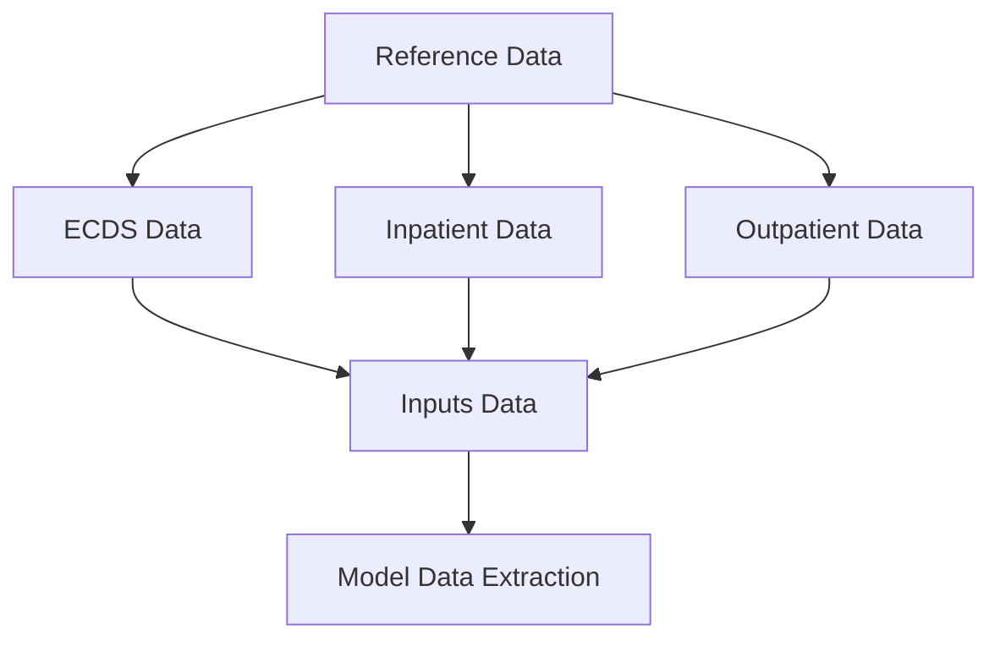

# NHP Data

A comprehensive data processing pipeline for the New Hospital Programme (NHP) [model](https://github.com/the-strategy-unit/nhp_model).
This project orchestrates the extraction, transformation, and preparation of data required for the model.

Built to work in pyspark on Databricks, with Hospital Episode Statistics (HES) data.

* Admitted Patient Care (APC)
* Outpatient Appointments (OPA)
* Emergency Care Dataset (ECDS), and for historical trends, Accident and Emergency (AAE)
* ONS Population Projections
* NHS Reference Data

## Architecture

The project uses Databricks Asset Bundles to manage deployment.
All processing is orchestrated through Databricks workflows that can run independently, or as part
of the main pipeline.



The workflows are built into a python package, with all of the code in the `src/` folder.
Each task in the workflows is defined as an entry point in `pyproject.toml`, and by convention is
a `main()` function which takes no arguments (parameters passed in via `sys.argv`).

## Getting Started

### Prerequisites

* Access to Databricks workspace
* Appropriate permissions for access to the data
* Python 3.11+
* uv

### Installation

The project is packaged as a Python wheel and deployed via Databricks bundles:

``` sh
# Build the package
uv build

# Deploy to development
databricks bundle deploy --target dev
```
Deployment to the `prod` target is via GitHub actions, and should not be done manually.

## Running Workflows

### Run the complete data pipeline:

``` sh
databricks jobs run --job-name "Generate NHP Data"
```

### Run individual components:

``` sh
# Process reference data only
databricks jobs run --job-name "Generate NHP Data (Reference Data)"

# Process emergency care data
databricks jobs run --job-name "Generate NHP Data (AAE/ECDS)"

# Extract data for modeling containers
databricks jobs run --job-name "Extract NHP for containers"
```